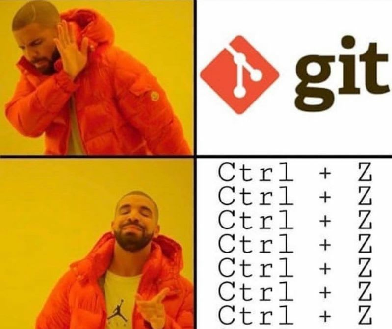
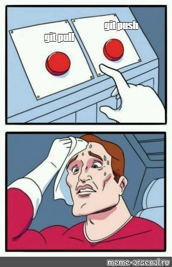
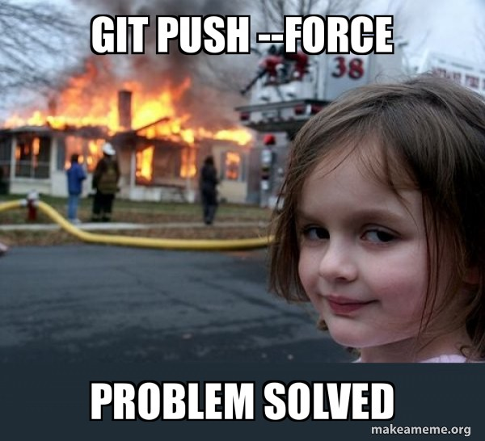
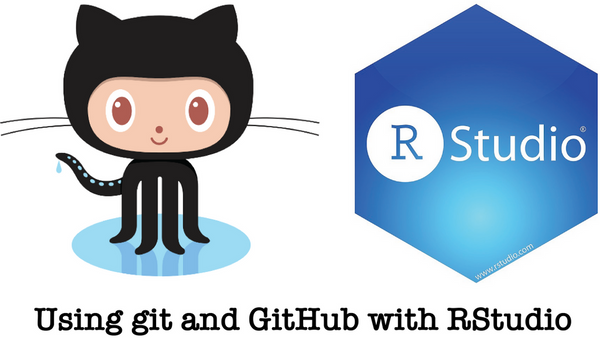
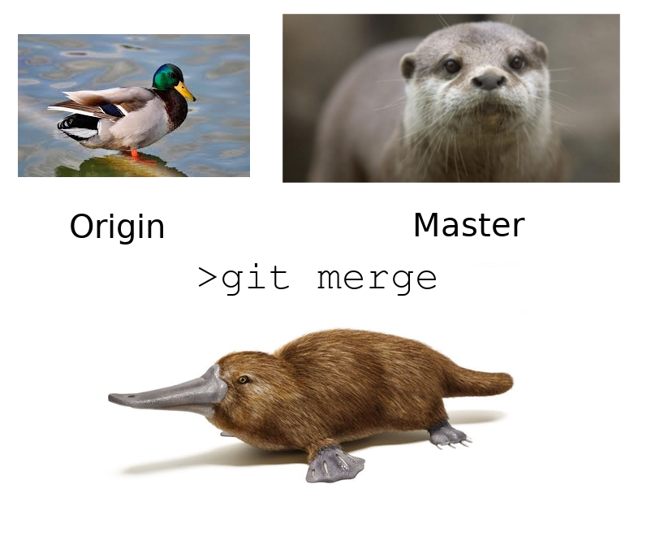

```{r xaringanExtra-clipboard, echo=FALSE}
# No quitar! Es para que aparezca la opción copy code en los R chunks
xaringanExtra::use_clipboard()
```

class: inverse

.pull-right[<br>
```{r, echo=FALSE, out.width='80%', fig.align='center'}
knitr::include_graphics("css/xolo.png")
```
]

# Agradecimientos

Este contenido se basó en:

- "Happy Git with R" de Jenny Bryan, los STAT 545 TAs, Jim Hester 

[https://happygitwithr.com/](https://happygitwithr.com/)

---

# ¿Por qué hacer control de versiones de nuestros proyectos?

- Los proyectos suelen cambiar y crecer.
- Es difícil saber cuáles fueron todos los cambios a lo largo del tiempo (en especial tiempos largos ⏳, hazlo por tu **yo** del futuro 👽).
- Las colaboraciones se pueden complicar sin un buen control de versiones 🔆.
- Seguridad de tu información 🔐. 

---
.pull-left[<br>
```{r, echo=FALSE, out.width='80%', fig.align='center'}
knitr::include_graphics("img/git_why.png")
```
]

.pull-right[<br>
```{r, echo=FALSE, out.width='80%', fig.align='center'}
knitr::include_graphics("img/git.png")
```
]
---

# Git

- Git es un sistema de control de versiones.
- Git funciona con GitHub, Bitbucked o Gitlab
- ¿Por qué usar Git en vez de solo renombrar los archivos? Porque es mejor tener una filogenia del archivo.

```{r, echo=FALSE, out.width='60%', fig.align='center'}
knitr::include_graphics("img/git_logo.png")
```

---
# Versión de controles a mano vs Git
.pull-left[
```{r, echo=FALSE, out.width='100%', fig.align='center'}
knitr::include_graphics("img/git_control.png")
```
]

.pull-right[
```{r, echo=FALSE, out.width='95%', fig.align='center'}

```
]

---
Con Git cada contribuidor tiene una copia del repositorio central, con todos los archivos y la historia de los cambios por los que han pasado.

```{r, echo=FALSE, out.width='50%', fig.align='center'}
knitr::include_graphics("img/git_repo.png")
```

---
# GitHub

GitHub es una plataforma que permite guardar código en forma de repositorios Git.

```{r, echo=FALSE, out.width='60%', fig.align='center'}
knitr::include_graphics("img/github.png")
```

---
# Proyectos colaborativos

- GitHub se parece más a un GoogleDoc que a un Word Document.
- Es fácil que los colaboradores hagan cambios y también es fácil saber quién hizo que.
- El dueño del proyecto puede dar permisos a los diferentes colaboradores. 
- También existen organizaciones, esto puede ser útil para manejar los permisos de grupos grandes de colaboración. 

---
# R en GitHub

- 👍 La comunidad de R es muy activa en GitHub. Hay muchos paquetes ahí, como el **tidyverse**.
- 👍 Al ser parte de GitHub será más fácil que su código se utilice por la comunidad.
- 👍 GitHub y RStudio se conectan muy bien. 
- 👍 Si R no es su lenguaje favorito, también se pueden beneficiar de usar RStudio para manejar su repositorio. 


---
# ¿Qué necesitamos para que funcione?

👀 Para este punto necesitamos tener **Git** en la computadora. 

⚠️ En caso de que aún no lo hayas instalado, lo puedes descargar en el siguiente enlace [https://git-scm.com/downloads](https://git-scm.com/downloads). 

💻 En la terminal: `which git` y `git --version`

👉 Necesitamos que Git se conecte con GitHub (o la plataforma que desees usar, puede ser GitLab o Bitbucked). Por tanto necesitamos una cuenta en GitHub. 

☝️ Luego necesitamos que R este enlazado con este repositorio. Tomemos un tiempo para revisar que todo esté en orden. 

---
# Recomendaciones generales y `Rproj`

📁 Es mejor organizar todo en un RStudio Project, para dedicar un directorio exclusivo a cada proyecto.

📌 Hacer un repositorio Git. Se trabaja como siempre, solo además de guardar, no olvides hacer `commit`.

✏️ De vez en cuando has `push` de los cambios cuando los hayas **verificado**

---
class: chapter-slide

# Manos a la obra!

---
# Primeros pasos

1. Familiarizarnos y conectarnos a GitHub.
2. Revisar que Git este enlazado a RStudio.
3. Crear un repositorio con GitHub.


---
# Creación de repositorio

1. Hagan login y creen un repositorio nuevo. Denle nombre: "repo_cdsb2022".
2. Añadan una descripción e inicialicen el repositorio con un README.
3. Para lo demás usen los defaults.
4. Den click en "Create repository".

---
# Creación de TOKEN en GitHub

1. Ve a tu perfil de GitHub, dale click a la imagen de perfil (usualmente en la esquina superior derecha), y busca la opción de *settings* ó *configuración* según sea la configuración de idioma que tengas. 

2. Da click a continuación en *Developer settings* ó *Parámetros del desarrollador*. 

3. En la barra lateral izquierda da click en *Tokens de acceso personal*. 

4. Haz click en *Generar un nuevo token*.


---
# Configuración de credenciales

- Algunas instalaciones de Git son muy listas y guardan el username y password, así que no lo tenemos que poner en cada `push`. Pero en las nuevas políticas de GitHub ahora no se usa la password, se usa el **PAT**.
- Si por algo no está funcionando:
    - [https://happygitwithr.com/credential-caching.html](https://happygitwithr.com/credential-caching.html)
    - [https://happygitwithr.com/ssh-keys.html](https://happygitwithr.com/ssh-keys.html)
    
Para configurarlo por primera vez:

```{bash eval=FALSE}
$ git config --global user.name "Erick Cuevas"
$ git config --global user.email ecuevas@example.com
```


---
# Clonar repositorio

- Ya tenemos el repositorio en GitHub.
- Para de verdad poder usarlo, lo tenemos que traer a nuestras computadoras. **A clonar!**
- Copien la liga en **"Clone or download"**.
- Vamos al `path` en que vayamos a trabajar. 

```{bash eval=FALSE}
git clone https://github.com/you/your_repo
```

---
# Usemos el repositorio

Vamos a usar el repositorio como nuestro lugar de trabajo:

```{bash eval=FALSE}
cd myrepo
ls -la
head README.md
git remote show origin
```

¿Qué nos dice este comando?

---
# Usemos el repositorio

Probemos haciendo un cambio en el README

```{bash eval=FALSE}
echo "Agregue algo al README" >> README.md
git status
```

Ahora tenemos que decirle a git que queremos seguir los cambios de ese archivo. Vamos a comentar los cambios `commit` y luego subirlos `push` a GitHub

```{bash eval=FALSE}
git add README.md
git commit -m "A commit from my local computer"
git pull
git push
```

---

```{r, echo=FALSE, out.width='70%', fig.align='center'}

```

---
# Usemos el repositorio

- `add` es algo que se hace la primera vez que se usa un archivo. Con la opción `-A` se agregan todos los archivos de un folder.
- ⚠️ ¡Piensen bien antes de hacer eso! A veces no queremos todos los archivos en un folder.
- Usen mensajes **INFORMATIVOS** en los `commits`, puede ser información muy útil en el futuro. 

Verifica si los cambios se subieron a GitHub.
---

```{r, echo=FALSE, out.width='30%', fig.align='center'}

```

```{bash eval=FALSE}
git pull
git push
```

---
# Tip de buenas prácticas

⚠️ Recuerda que cuando estes trabajando de manera colectiva, hacer siempre primero un `pull` para actualizar los cambios al repositorio y evitar los conflictos de versiones. Al final veremos un poco de conflicto de versiones. 

```{r, echo=FALSE, out.width='30%', fig.align='center'}

```

---
# Conectando RStudio con Git y Github.

```{r,echo=FALSE, out.width='40%', fig.align='center'}

```

Para lo que sigue a continuación, deberías tener esto:

1. Tener una cuenta en GitHub
2. **R** y **RStudio** actualizados
3. Git instalado
4. Saber que desde la terminal puedes hacer **push** y **pull**

---
# Vamos a RStudio 

```{r eval=FALSE}
usethis::use_git_config(user.name = "YourName", user.email = "your@mail.com")
```

Para confirgurar nuestra **PAT** en RStudio debemos hacer lo siguiente. Con este comando vamos a acceder al **Enviroment** de R, ⚠️ CUIDA LOS ESPACIOS Y LAS MODIFICACIONES QUE HAGAS AQUÍ!!!

```{r eval=FALSE}
usethis::edit_r_environ()
```

Aquí añade la siguiente línea, ⚠️ y asegúrese de que '.Renviron' termine con una nueva línea.

````markdown
GITHUB_PAT=xxxyyyzzz
```` 
---
# Conectando Git y RStudio

- Hasta ahora todo lo de Git ha sido en línea de comando. **Pero RStudio nos puede ayudar con esto**.
- Para lograrlo, primero necesitamos que RStudio se conecte con Git.

1. Crea un proyecto en RStudio desde un `repositorio` de Git. `File` > `New Project` > `Version Control` > `Git`. Ahi pega el URL del repositorio `https://github.com/mi_usuario/mi_repositorio.git`. Da click en Create Project.
2. ¿En dónde vas a guardar ese repositorio? 
3. Git va a aparecer en la esquina superior.
4. Hagamos un cambio en el README

---
# Conectando Git y RStudio

Esto nos generará los siguientes elementos:

- Un directorio nuevo
- Un repositorio Git enlazado a al repositorio de GitHub
- Un proyecto en RStudio

Con este procedimiento ya no es necesario preocuparse por configurar controles remotos Git
y rastrear ramas en la línea de comandos.

---
# Actividad Individual

- Genera un repositorio con el nombre que desees. Y conéctalo a RStudio. Cerciórate de que el archivo *README* se encuentre en tu nueva carpeta. 
- Usa la función `usethis::use_r("titulo_de_un_script")` y observa lo que sucede.

---
# Comentar, pull y push

.pull-left[
```{r,echo=FALSE, out.width='100%', fig.align='center'}
knitr::include_graphics("img/gitrstudio_comment.png")
```
]

.pull-right[
```{r,echo=FALSE, out.width='100%', fig.align='center'}
knitr::include_graphics("img/gitrstudio_push.png")
```
]

---
# Commit, pull y push en RStudio

Desde RStudio:

1. Da click en el **Git** tab panel superior derecho. 
2. Has click en **Staged** para README.md
3. Da click en **commit**.
4. Escribe un mensaje útil en **Commit message**.
5. Click **Commit**.
6. Click **push**.

---
# Otra forma de usar RStudio en un repositorio.

1. Clona un repositorio de manera normal desde la terminal. 

```{bash eval=FALSE}
git clone https://github.com/you/your_repo
```

2. Busca una carpeta donde tengas un `.Rproj` antigüo o que quieras enlazar a github. 

3. **Y LISTO!!** usa un simple `ctrl` + `c`, ó `mv` ó `click derecho` + `copiar` ó el método que prefieras para mover o copiar archivos. Copia los archivos de tu antigüo proyecto al proyecto nuevo. Solo haz *commit* y *push* y listo, lo que tenía en tu antigüo proyecto ya está enlazado a GitHub. 

---
# Actividad 

- Usa el código `dir.create("mis_imagenes")` en la consola de tu sesión de RStudio (la que está vinculada a tu repositorio).

- Descarga cualquier imagen que desees, y guardala en "mis_imagenes".

- Comenta y da push a los cambios que realizaste en el repositorio. 

---

# Actividad

Por equipos de 6 personas:

1. Todos clonen un repositorio de GitHub en común. Enlacelo a GitHub y sigan el procedimiento de **RStudio primero y GitHub también** en el Material del libro.  

2. Seleccionen con que datos quieren trabajar por equipo, al correr el siguiente comando les mostrara el nombre de los datos disponibles en R base.

```{r, eval=FALSE}
data()
```

---
# Actividad

3. Creen una carpeta para guardar imagenes. Por persona generen un grafico representativo de su dataset, guardelo en la carpeta de imagenes. Compartan entre el equipo sus creaciones al hacer **commit/pull/push**.  

---
# Git EXTRA

¿Qué pasó? ¿Qué hacemos ahora?

Ahora ya tienes todo para subir tus cosas a GitHub y documentarlas muy bien.

---
# Git conceptos 

Repository, diff

```{r,echo=FALSE, out.width='80%', fig.align='center'}
knitr::include_graphics("img/git_diff.png")
```

---
# Conflictos del "Merge"

- A veces, no tan a veces, también, las cosas no salen bien a la primera. **Merge** (fusionar es una de esas cosas)
- Cuando bajamos un cambio o fusionamos "ramas" esto puede pasar. 
- Primera regla: NO ENTRAR EN PÁNICO!
- Revisen el status del repositorio: ¿qué archivo tiene conflicto?

```{r,echo=FALSE, out.width='30%', fig.align='center'}

```

---
# Conflictos del "Merge"

Abran ese archivo y busquen los problemas de merge. Es fácil, se ven así:

````markdown
<<<<<<< HEAD:index.html
<div id="footer">contact : email.support@github.com</div>
=======
<div id="footer">
 please contact us at support@github.com
</div>
>>>>>>> issue-5:index.html
````

Editen esa sección, dejen una versión final. Hagan commit y push. No dejen de aprender Git. 

---

.pull-left[<br><br><br><br><br><br><br>
.center[
# ¡Gracias! 
]
]

.pull-right[<br>
```{r, echo=FALSE, out.width='80%', fig.align='center'}
knitr::include_graphics("css/xolo.png")
```

]
