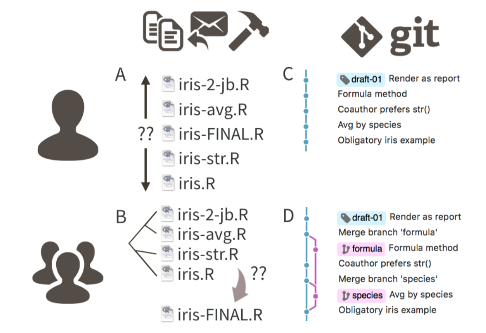

```{r xaringanExtra-clipboard, echo=FALSE}
# No quitar! Es para que aparezca la opción copy code en los R chunks
xaringanExtra::use_clipboard()
```

class: inverse

.pull-right[<br>
```{r, echo=FALSE, out.width='80%', fig.align='center'}
knitr::include_graphics("css/xolo.png")
```
]

# Agradecimientos

Este contenido se basó en:

- "Happy Git with R" de Jenny Bryan, los STAT 545 TAs, Jim Hester 

[https://happygitwithr.com/](https://happygitwithr.com/)

---

# ¿Por qué hacer control de versiones de nuestros proyectos?

- Los proyectos suelen cambiar y crecer.
- Es difícil saber cuáles fueron todos los cambios a lo largo del tiempo (en especial tiempos largos ⏳, hazlo por tu **yo** del futuro 👽).
- Las colaboraciones se pueden complicar sin un buen control de versiones 🔆.
- Seguridad de tu información 🔐. 

---
.pull-left[<br>
```{r, echo=FALSE, out.width='80%', fig.align='center'}
knitr::include_graphics("img/git_why.png")
```
]

.pull-right[<br>
```{r, echo=FALSE, out.width='80%', fig.align='center'}

```
]
---

# Git

- Git es un sistema de control de versiones.
- Git funciona con GitHub, Bitbucked o Gitlab
- ¿Por qué usar Git en vez de solo renombrar los archivos? Porque es mejor tener una filogenia del archivo.

```{r, echo=FALSE, out.width='60%', fig.align='center'}
knitr::include_graphics("img/git_logo.png")
```

---
# Versión de controles a mano vs Git

```{r, echo=FALSE, out.width='65%', fig.align='center'}

```

---
Con Git cada contribuidor tiene una copia del repositorio central, con todos los archivos y la historia de los cambios por los que han pasado.

```{r, echo=FALSE, out.width='50%', fig.align='center'}
knitr::include_graphics("img/git_repo.png")
```

---
# GitHub

GitHub es una plataforma que permite guardar código en forma de repositorios Git.

```{r, echo=FALSE, out.width='60%', fig.align='center'}
knitr::include_graphics("img/github.png")
```

---
# Proyectos colaborativos

- GitHub se parece más a un GoogleDoc que a un Word Document.
- Es fácil que los colaboradores hagan cambios y también es fácil saber quién hizo que.
- El dueño del proyecto puede dar permisos a los diferentes colaboradores. 
- También existen organizaciones, esto puede ser útil para manejar los permisos de grupos grandes de colaboración. 

---
# R en GitHub

- 👍 La comunidad de R es muy activa en GitHub. Hay muchos paquetes ahí, como el **tidyverse**.
- 👍 Al ser parte de GitHub será más fácil que su código se utilice por la comunidad.
- 👍 GitHub y RStudio se conectan muy bien. 
- 👍 Si R no es su lenguaje favorito, también se pueden beneficiar de usar RStudio para manejar su repositorio. 


---
# ¿Qué necesitamos para que funcione?

👀 Para este punto necesitamos tener **Git** en la computadora. 

⚠️ En caso de que aún no lo hayas instalado, lo puedes descargar en el siguiente enlace [https://git-scm.com/downloads](https://git-scm.com/downloads). 

💻 En la terminal: `which git` y `git --version`

👉 Necesitamos que Git se conecte con GitHub (o la plataforma que desees usar, puede ser GitLab o Bitbucked). Por tanto necesitamos una cuenta en GitHub. 

☝️ Luego necesitamos que R este enlazado con este repositorio. Tomemos un tiempo para revisar que todo esté en orden. 

---
# Recomendaciones generales y `Rproj`

📁 Es mejor organizar todo en un RStudio Project, para dedicar un directorio exclusivo a cada proyecto.

📌 Hacer un repositorio Git. Se trabaja como siempre, solo además de guardar, no olvides hacer `commit`.

✏️ De vez en cuando has `push` de los cambios cuando los hayas **verificado**

---
class: chapter-slide

# Manos a la obra!

---
# Primeros pasos

1. Familiarizarnos y conectarnos a GitHub.
2. Revisar que Git este enlazado a RStudio.
3. Crear un repositorio con GitHub.


---
# Creación de repositorio

1. Hagan login y creen un repositorio nuevo. Denle nombre: "repo_cdsb2022".
2. Añadan una descripción e inicialicen el repositorio con un README.
3. Para lo demás usen los defaults.
4. Den click en "Create repository".

---
# Creación de TOKEN en GitHub


---
# Clonar repositorio

- Ya tenemos el repositorio en GitHub.
- Para de verdad poder usarlo, lo tenemos que traer a nuestras computadoras. **A clonar!**
- Copien la liga en **"Clone or download"**.
- Vamos al `path` en que vayamos a trabajar. 

```{bash eval=FALSE}
git clone https://github.com/you/your_repo
```

---
# Usemos el repositorio

Vamos a usar el repositorio como nuestro lugar de trabajo:

```{bash eval=FALSE}
cd myrepo
ls -la
head README.md
git remote show origin
```

¿Qué nos dice este comando?

---
# Usemos el repositorio

Probemos haciendo un cambio en el README

```{bash eval=FALSE}
echo "Agregue algo al README" >> README.md
git status
```

Ahora tenemos que decirle a git que queremos seguir los cambios de ese archivo. Vamos a comentar los cambios `commit` y luego subirlos `push` a GitHub

```{bash eval=FALSE}
git add README.md
git commit -m "A commit from my local computer"
git push
```

---
.pull-left[<br><br><br><br><br><br><br>
.center[
# ¡Gracias! 
]
]

.pull-right[<br>
```{r, echo=FALSE, out.width='80%', fig.align='center'}
knitr::include_graphics("css/xolo.png")
```

]
