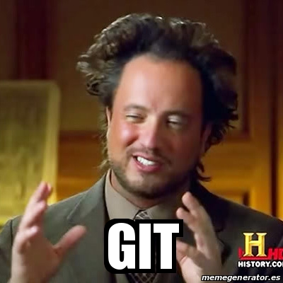

```{r xaringanExtra-clipboard, echo=FALSE}
# No quitar! Es para que aparezca la opción copy code en los R chunks
xaringanExtra::use_clipboard()
```

class: inverse

.pull-right[<br>
```{r, echo=FALSE, out.width='80%', fig.align='center'}
knitr::include_graphics("css/xolo.png")
```
]

# Agradecimientos

Este contenido se basó en:

- "Happy Git with R" de Jenny Bryan, los STAT 545 TAs, Jim Hester 

[https://happygitwithr.com/](https://happygitwithr.com/)

---

# ¿Por qué hacer control de versiones de nuestros proyectos?

- Los proyectos suelen cambiar y crecer.
- Es difícil saber cuáles fueron todos los cambios a lo largo del tiempo (en especial tiempos largos ⏳, hazlo por tu **yo** del futuro 👽).
- Las colaboraciones se pueden complicar sin un buen control de versiones 🔆.
- Seguridad de tu información 🔐. 

---
.pull-left[<br>
```{r, echo=FALSE, out.width='80%', fig.align='center'}
knitr::include_graphics("img/git_why.png")
```
]

.pull-right[<br>
```{r, echo=FALSE, out.width='80%', fig.align='center'}

```
]
---

# Git

- Git es un sistema de control de versiones.
- Git funciona con GitHub, Bitbucked o Gitlab
- ¿Por qué usar Git en vez de solo renombrar los archivos? Porque es mejor tener una filogenia del archivo.

```{r, echo=FALSE, out.width='80%', fig.align='center'}
knitr::include_graphics("img/git_logo.png")
```

---
# Versión de controles a mano vs Git

```{r, echo=FALSE, out.width='80%', fig.align='center'}
knitr::include_graphics("img/git_control.png")
```

---
# Versión de control en Git

Con Git cada contribuidor tiene una copia del repositorio central, con todos los archivos y la historia de los cambios por los que han pasado.

---
# Preparar nuestra sesión de R

```{r echo=TRUE, eval=FALSE}
# Instalar desde el repositorio de CRAN
install.packages("rmarkdown")

# O también puedes instalar la versión en desarrollo
if (!requireNamespace("devtools"))
  install.packages('devtools')
devtools::install_github('rstudio/rmarkdown')

# Instalar la paquetería para poder compilar en LaTeX
install.packages('tinytex')
tinytex::install_tinytex()  # install TinyTeX
```

Con RStudio en automático tenemos [**pandoc**](http://pandoc.org/) y [**knitr**](https://yihui.org/knitr/)

---
class: inverse

# 1. ¿Qué es y para que sirve RMarkdown?

**Rmarkdown** se basa en el lenguaje *markdown* que sirve para convertir texto plano a formato HTML. Este tipo de archivo de archivo esta disponible en RStudio, y esto nos permite integrar código con texto. 

Puedes obtener los siguientes archivos de salida:

- PDF
- HTML
- Microsoft Word


---


---

class: chapter-slide

# Algunos usos

---

##Agregar en un informe la información de una localización


---
class: center

## Poner la chicharronera (Fórmula cuadrática en un texto)

Esto es la chicharronera dentro de un texto $$x = \frac {-b \pm \sqrt {b^2 - 4ac}}{2a}$$

Y puedo seguir describiendo lo que siga haciendo.

$$\text{La Fórmula Cuadrática es }x = \frac {-b \pm \sqrt {b^2 - 4ac}}{2a}$$
---
.center[
# Ejemplos de uso y páginas útiles
]

- [RPubs](https://rpubs.com)
- [Generar correos personalizados](https://rmarkdown.rstudio.com/articles_mail_merge.html)
- [Escribir artículos](https://elifesciences.org/labs/cad57bcf/composing-reproducible-manuscripts-using-r-markdown)
  - [rticles](https://github.com/rstudio/rticles)
- [Escribir Libros](https://bookdown.org/)
  - [Escribir tesis](https://eddjberry.netlify.com/post/writing-your-thesis-with-bookdown/)
- [Crear sitios web](https://github.com/seankross/postcards)


---
.center[
# Crear un archivo `Rmd`
]

## Paso 1


---

## Paso 2

---
# Listo, tenemos un archivo listo `Rmd`

`

---
.pull-left[<br><br><br><br><br><br><br>
.center[
# ¡Gracias! 
]
]

.pull-right[<br>
```{r, echo=FALSE, out.width='80%', fig.align='center'}
knitr::include_graphics("css/xolo.png")
```

]
